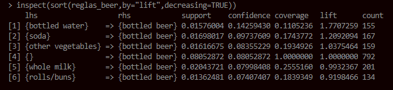

# Tp05.03ReglasDeAsociacion-R

## 1. Soporte & Confianza. Calcule el soporte y la confianza (cuando corresponda) de los ítemsets del siguiente fragmento del dataset:
### a. Calcule el soporte para todos los ítemsets del dataset.
### b. Arme todas las reglas resultantes considerando que se solicita un soporte mínimo de 0,3.


### c. ¿Cuál es el soporte de A? ¿Cómo es el soporte de AB, AC y ABC con respecto al de A? ¿Por qué?

| itemset | soporte |
| ----- | ----- |
| A  | 0,7  |
| AB  | 0,3  |
| AC  | 0,4  |
| ABC  | 0,2  |

Los valores de soporte son mas chicos porque a medida que voy agregando elementos, la frecuencia de estos ultimos va a ser como maximo igual al conjunto mayor, en este caso {A}. 

### d. ¿Cuáles son las reglas de asociación resultantes si establecemos una confianza mínima de 0,7?

| itemset | confianza |
| --------- | --------- |
| σ({A}->{C})  | 0,57  |
| σ({B}->{C})  | 0,66  |
| σ({A}->{B})  | 0,42  |
| σ({AC}->{B})  | 0,5  |
| σ({AB}->{C})  | 0,6  |
| σ({BC}->{A})  | 0,6  |

Se puede observar que ninguna regla obtenida establece la confianza minima requerida. 

## 2. Apriori. Incorpore en una herramienta de data mining el dataset sobre la cesta de compras y responda:

### a. ¿Qué parámetros puedo modificar previo a ejecutar el algoritmo sobre el dataset? ¿Qué permite cada uno?


estructura de una REGLA

LHS (parte izquierda de la regla) => RHS (parte derecha de la regla)
ejemplo regla: 
          
| LHS (Left Hand Side) | implicacion | RHS (Right Hand Side) |
| --------- | --------- | --------- |
| "butter"  | => | "bottled beer" |


```
reglas_beer <- apriori(Groceries, parameter = list(support=0.01, confidence=0.01, target = "rules"), appearance = list(lhs="bottled beer"))

```

```
parametros = lista(
    support = frecuencia relativa de una regla sobre el total de transacciones
    confidence = veces que RHS se presenta cuando se presenta LHS por cada regla
    target = resultado solicitado {
        'rules': todas las reglas resultantes;
        'frequent itemsets': itemsets mas frecuentes }
)
```


### b. ¿Es posible ejecutar el algoritmo apriori con el dataset tal como se encuentra? Realice las operaciones necesarias para permitirlo.

No. Hay que aplicar filtros sobre el suporte y la confianza aceptados. Luego de manera opcional se puede aplicar filtros sobre los lados izquierdo (LHS) o derecho (RHS) de la regla.

```
reglas <- apriori(Groceries, parameter = list(supp = 0.01, conf = 0.2)) 
inspect(reglas) 
```

### c. Ejecute el algoritmo Apriori sobre los datos y detalle cuáles son las mejores reglas encontradas. ¿Cómo determina cuales son las mejores?


Las mejores reglas encontradas son aquellas que tienen valores altos de lift.

### d. ¿Qué nota al ejecutar el algoritmo con el dataset actual? ¿Cuál es la complejidad computacional del mismo? ¿Cómo puede resolverse?


Son 169 items por lo tanto se tiene una comlpejidad de 2 elevado a 169 elementos, lo que hace intratable el numero de candidatos.
para resolver este inconveniente, se usan tecnicas de poda para reducir "M":
* reduciendo el numero de comparaciones, 
* aumentando el tamaño de los itemsets, 
* utilizando el algoritmo de apriori

### e. Si tuviera que analizar los resultados desde el punto de vista de un analista especializado en marketing, ¿Cuáles son las asociaciones encontradas que le parecen más interesantes? ¿Qué políticas podría implementar a partir de estas?

Las asociaciones mas interesantes serian aquellas con valores altos de lift


- En este caso, se puede ver que las personas que compran leche entera y yogurt son 3 veces mas propensos a comprar cortes de queso (curd).
- Las personas que compran frutas citricas y otros vegetales son 3 veces mas propensos a comprar vegetales de raiz. 
- las personas que compran otros vegetales y yogurt son 3 veces mas propensos a comprar crema batida. 

### f. Explore alguna visualización para el análisis de reglas generadas, explique brevemente.


Aquellos items que, con mas frecuencia como la leche entera (whole milk), son los que tienen mayor soporte, estos son los items de mayor interes. 

### g. Utilizando el mismo punto de vista, ¿Cuáles son los ítems que marcan la presencia de cerveza? ¿Encuentra una relación lógica en estas asociaciones?



Los items:
- agua en botella
- soda
- otros vegetales
- leche entera
- rollos/ bollos

marcan la presencia de cerveza. En cuanto a la relacion logica, tienen relacion en lineas generales. 

### h. ¿Qué parámetros ajustaría a efectos de modificar la cantidad de reglas de asociación generadas? ¿Qué efecto generan esos parámetros? Ejemplifique en función del dataset actual.

los parametros a justar son: 
```
apriori(Groceries, parameter = list(support=0.01, confidence=0.01, target = "rules"), appearance = list(rhs="bottled water"))

en el caso de support: puedo filtrar por aquellas reglas con un support >= 0.01
en el caso de confidence: puedo filtrar por aquellos valores de confidence >= 0.01
target: puedo elegir mostrar todas las reglas ó los itemsets mas frecuentes
rhs: se puede filtrar por aquellas reglas en las que aparezcan determinados items

```

A manera de ejemplo, si ajustamos el support
```
apriori(Groceries, parameter = list(support=0.09, confidence=0.01, target = "rules")
```
tenemos como resultado un total de 8 reglas, con el factor izquierdo de la regla vacio. Es decir, transacciones en las que solo se compro un solo item, por ejemplo: leche entera.


### i. Documente todas las actividades desarrolladas y exprese sus conclusiones en cada caso.

Las conclusiones fueron realizadas en cada punto.

## 3. Incorpore el dataset del Banco de Portugal utilizado en el TP de árboles de decisión y realice las siguientes operaciones:

### a. Aplique las transformaciones necesarias a efectos de poder correr el algoritmo apriori sobre el dataset.

Para poder hacer un analisis, es necesario discretizar las variables numericas, a efectos de establecer rangos etiquetados que me permitan extraer la mayor cantidad de informacion posible. 

Como primeros pasos voy examinando el rango de los datos, para establcer luego las etiquetas que me guien lo mejor posible en el proceso de interpretacion de los datos.


Dejo en el siguiente archivo de texto los comando realizados para la obtencion del dataset discretizado -> [comandos](code/punto-3/comandos.txt)


### b. Ejecute el algoritmo apriori y explique los resultados más importantes.

Una vez que tenemos el dataset depurado y tranformado a un tipo de dato transaccion, procedemos a ejecutar el algoritmo de apriori. Nos vamos a concentrar en aquellas reglas donde el RHS corresponde a que el cliente haya suscripto a un plazo fijo 
Se puede ver que habiendo aplicado el algoritmo de apriori, tenemos como resultado un total de 13074 reglas
de las cuales las ordenamos en forma decreciente por valores de lift, 

```
Apriori

Parameter specification:

Algorithmic control:

Absolute minimum support count: 452 

set item appearances ...[1 item(s)] done [0.03s].
set transactions ...[73 item(s), 45211 transaction(s)] done [0.20s].
sorting and recoding items ... [63 item(s)] done [0.03s].
creating transaction tree ... done [0.10s].
checking subsets of size 1 2 3 4 5 6 7
writing ... [13074 rule(s)] done [0.09s].
creating S4 object  ... done [0.09s].
set of 13074 rules

rule length distribution (lhs + rhs):sizes
   1    2    3    4    5    6    7 
   1   43  377 1497 3289 4343 3524 

   Min. 1st Qu.  Median    Mean 3rd Qu.    Max. 
  1.000   5.000   6.000   5.689   7.000   7.000 

summary of quality measures:
    support          confidence         coverage            lift            count       
 Min.   :0.01002   Min.   :0.03389   Min.   :0.01471   Min.   :0.2897   Min.   : 453.0  
 1st Qu.:0.01163   1st Qu.:0.09704   1st Qu.:0.07771   1st Qu.:0.8295   1st Qu.: 526.0  
 Median :0.01409   Median :0.13126   Median :0.11808   Median :1.1220   Median : 637.0  
 Mean   :0.01752   Mean   :0.16573   Mean   :0.14493   Mean   :1.4166   Mean   : 792.1  
 3rd Qu.:0.01962   3rd Qu.:0.17811   3rd Qu.:0.18272   3rd Qu.:1.5225   3rd Qu.: 887.0  
 Max.   :0.11698   Max.   :0.70732   Max.   :1.00000   Max.   :6.0462   Max.   :5289.0  

mining info:
     lhs                                rhs                 support confidence   coverage     lift count
[1]  {bnk_port.housing=no,                                                                              
      bnk_port.loan=no,                                                                                 
      bnk_port.contact=cellular,                                                                        
      bnk_port.poutcome=success}     => {bnk_port.y=yes} 0.01411161  0.7073171 0.01995090 6.046230   638
[2]  {bnk_port.default=no,                                                                              
      bnk_port.housing=no,                                                                              
      bnk_port.loan=no,                                                                                 
      bnk_port.contact=cellular,                                                                        
      bnk_port.poutcome=success}     => {bnk_port.y=yes} 0.01411161  0.7073171 0.01995090 6.046230   638
[3]  {bnk_port.housing=no,                                                                              
      bnk_port.loan=no,                                                                                 
      bnk_port.contact=cellular,                                                                        
      bnk_port.pdays=poco tiempo,                                                                       
      bnk_port.poutcome=success}     => {bnk_port.y=yes} 0.01265179  0.7070457 0.01789388 6.043911   572
[4]  {bnk_port.default=no,                                                                              
      bnk_port.housing=no,                                                                              
      bnk_port.loan=no,                                                                                 
      bnk_port.contact=cellular,                                                                        
      bnk_port.pdays=poco tiempo,                                                                       
      bnk_port.poutcome=success}     => {bnk_port.y=yes} 0.01265179  0.7070457 0.01789388 6.043911   572
[5]  {bnk_port.housing=no,                                                                              
      bnk_port.loan=no,                                                                                 
      bnk_port.contact=cellular,                                                                        
      bnk_port.campaign=pocas veces,                                                                    
      bnk_port.poutcome=success}     => {bnk_port.y=yes} 0.01408949  0.7069922 0.01992878 6.043454   637
[6]  {bnk_port.default=no,                                                                              
      bnk_port.housing=no,                                                                              
      bnk_port.loan=no,                                                                                 
      bnk_port.contact=cellular,                                                                        
      bnk_port.campaign=pocas veces,                                                                    
      bnk_port.poutcome=success}     => {bnk_port.y=yes} 0.01408949  0.7069922 0.01992878 6.043454   637
[7]  {bnk_port.housing=no,                                                                              
      bnk_port.loan=no,                                                                                 
      bnk_port.contact=cellular,                                                                        
      bnk_port.campaign=pocas veces,                                                                    
      bnk_port.pdays=poco tiempo,                                                                       
      bnk_port.poutcome=success}     => {bnk_port.y=yes} 0.01262967  0.7066832 0.01787176 6.040812   571
[8]  {bnk_port.housing=no,                                                                              
      bnk_port.contact=cellular,                                                                        
      bnk_port.pdays=poco tiempo,                                                                       
      bnk_port.poutcome=success}     => {bnk_port.y=yes} 0.01311628  0.7059524 0.01857955 6.034565   593
[9]  {bnk_port.default=no,                                                                              
      bnk_port.housing=no,                                                                              
      bnk_port.contact=cellular,                                                                        
      bnk_port.pdays=poco tiempo,                                                                       
      bnk_port.poutcome=success}     => {bnk_port.y=yes} 0.01311628  0.7059524 0.01857955 6.034565   593
[10] {bnk_port.housing=no,                                                                              
      bnk_port.contact=cellular,                                                                        
      bnk_port.campaign=pocas veces,                                                                    
      bnk_port.pdays=poco tiempo,                                                                       
      bnk_port.poutcome=success}     => {bnk_port.y=yes} 0.01309416  0.7056019 0.01855743 6.031569   592
[11] {bnk_port.default=no,                                                                              
      bnk_port.housing=no,                                                                              
      bnk_port.contact=cellular,                                                                        
      bnk_port.campaign=pocas veces,                                                                    
      bnk_port.pdays=poco tiempo,                                                                       
      bnk_port.poutcome=success}     => {bnk_port.y=yes} 0.01309416  0.7056019 0.01855743 6.031569   592
[12] {bnk_port.default=no,                                                                              
      bnk_port.housing=no,                                                                              
      bnk_port.contact=cellular,                                                                        
      bnk_port.poutcome=success}     => {bnk_port.y=yes} 0.01464245  0.7050053 0.02076928 6.026469   662
[13] {bnk_port.housing=no,                                                                              
      bnk_port.loan=no,                                                                                 
      bnk_port.pdays=poco tiempo,                                                                       
      bnk_port.poutcome=success}     => {bnk_port.y=yes} 0.01393466  0.7046980 0.01977395 6.023842   630
[14] {bnk_port.default=no,                                                                              
      bnk_port.housing=no,                                                                              
      bnk_port.loan=no,                                                                                 
      bnk_port.pdays=poco tiempo,                                                                       
      bnk_port.poutcome=success}     => {bnk_port.y=yes} 0.01393466  0.7046980 0.01977395 6.023842   630
[15] {bnk_port.default=no,                                                                              
      bnk_port.housing=no,                                                                              
      bnk_port.contact=cellular,                                                                        
      bnk_port.campaign=pocas veces,                                                                    
      bnk_port.poutcome=success}     => {bnk_port.y=yes} 0.01462034  0.7046908 0.02074716 6.023781   661
[16] {bnk_port.housing=no,                                                                              
      bnk_port.loan=no,                                                                                 
      bnk_port.campaign=pocas veces,                                                                    
      bnk_port.pdays=poco tiempo,                                                                       
      bnk_port.poutcome=success}     => {bnk_port.y=yes} 0.01391254  0.7043673 0.01975183 6.021015   629
[17] {bnk_port.default=no,                                                                              
      bnk_port.housing=no,                                                                              
      bnk_port.loan=no,                                                                                 
      bnk_port.campaign=pocas veces,                                                                    
      bnk_port.pdays=poco tiempo,                                                                       
      bnk_port.poutcome=success}     => {bnk_port.y=yes} 0.01391254  0.7043673 0.01975183 6.021015   629
[18] {bnk_port.housing=no,                                                                              
      bnk_port.contact=cellular,                                                                        
      bnk_port.poutcome=success}     => {bnk_port.y=yes} 0.01464245  0.7042553 0.02079140 6.020058   662
[19] {bnk_port.housing=no,                                                                              
      bnk_port.contact=cellular,                                                                        
      bnk_port.campaign=pocas veces,                                                                    
      bnk_port.poutcome=success}     => {bnk_port.y=yes} 0.01462034  0.7039404 0.02076928 6.017366   661

```

y como datos importantes podemos observar que, aquellos clientes que:
- no tengan prestamo de vivienda (housing)
- no tengan prestamo personal (loan)
- que lo hayan contactado por telefono celular (contact)
- que haya pasado poco tiempo desde la finalizacion de la campaña anterior (pdays)
y, 
- donde la campaña anterior del banco haya sido exitosa (poutcome)

son en promedio hasta 6 veces propensos a que el cliente suscriba a un plazo fijo. 
Todos estos itemsets se repiten bastante, y con altos valores de confianza.

### c. ¿Cuáles son las asociaciones más importantes para determinar si el cliente aceptó o no el producto bancario?

Las asociaciones mas importantes son aquellas con valores altos de lift, cuyas asociaciones tiene que ver con, si no tiene prestamo bancario hipotecario o personal, que lo hayan contactado por celular, y que haya pasado poco tiempo entre el contacto desde la finalizacion de la campaña anterior. Esto ya fue explicado en el punto anterior.

### d. Compare los resultados obtenidos en este punto con respecto a los resultados obtenidos a través de la aplicación de árboles de decisión.


Se puede observar en relacion con los resultados de arboles de decision que el arbol no tiene en cuenta primordialemente las variables housing y loan para la aceptacion de la suscripcion a plazo fijo. En este sentido, me parece que las reglas de asociacion aportaron informacion mas logica y abundante, al momento de querer aplicar alguna politica durante la campaña, como ser concentrarse en aquellos clientes que cumplan especificamente con la regla de no tener plazo fijo, ni prestamo personal, y no dejar demasiado tiempo entre contactos por campaña bancaria.

### e. Documente todas las actividades desarrolladas y exprese sus conclusiones en cada caso.

Las conclusiones fueron realizadas en cada punto.